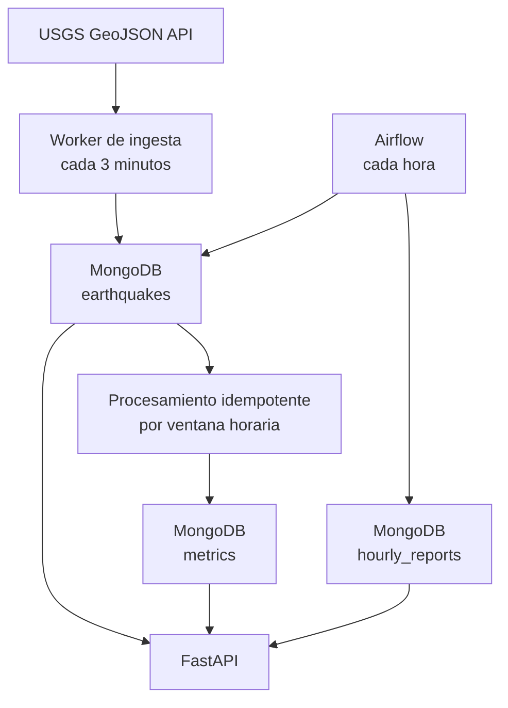

# Plataforma de eventos sísmicos USGS

Solución de la prueba técnica de procesamiento de eventos en near real-time con Python,
FastAPI, MongoDB, Airflow y Docker Compose.

**Autor:** Javier Rodríguez Mosquera

El sistema consulta el feed público de USGS cada tres minutos, valida y normaliza cada
evento, evita duplicados, actualiza métricas horarias inmediatamente y genera un reporte
consolidado cada hora. La solución incluye logs JSON, pruebas, colección Postman y un perfil
opcional de observabilidad con Prometheus y Grafana.

## Inicio rápido

Requisitos: Docker Engine 24+ y Docker Compose v2.

El paquete final descargable ya incluye un `.env` local, por lo que puede iniciarse directamente:

```bash
docker compose up --build
```

Si el proyecto fue clonado desde GitHub, `.env` no estará incluido por seguridad. Se puede
generar automáticamente con contraseñas aleatorias mediante:

```bash
python scripts/generate_env.py
docker compose up --build
```

Servicios disponibles:

| Servicio | URL | Uso |
|---|---|---|
| FastAPI | <http://localhost:8000/docs> | Swagger y consultas REST |
| Airflow | <http://localhost:8080> | DAG de reportes horarios |
| MongoDB | `localhost:27017` | Persistencia local |

Las credenciales locales están definidas únicamente en `.env`, archivo excluido del repositorio
por `.gitignore`. No se deben publicar contraseñas reales en GitHub.

La primera consulta del worker ocurre al iniciar; después se repite según
`INGESTION_INTERVAL_SECONDS` (180 segundos por defecto).

### Observabilidad opcional

```bash
docker compose --profile observability up --build
```

- Prometheus: <http://localhost:9090>
- Grafana: <http://localhost:3000>
- Métricas API: <http://localhost:8000/observability/metrics>

## Arquitectura



La ingesta y la API son procesos independientes. Ambos comparten contratos de dominio y
repositorios, pero pueden escalarse y desplegarse por separado. Airflow lee directamente la
capa operacional para crear un reporte reproducible e idempotente.

## Endpoints

### `GET /earthquakes`

Soporta paginación, filtros y ordenamiento:

```bash
curl "http://localhost:8000/earthquakes?page=1&page_size=10&min_magnitude=4&sort_by=magnitude&sort_order=desc"
```

Parámetros disponibles:

- `page`, `page_size`
- `min_magnitude`, `max_magnitude`
- `start_time`, `end_time` en ISO 8601
- `location`, búsqueda parcial sin distinguir mayúsculas
- `sort_by`: `event_time` o `magnitude`
- `sort_order`: `asc` o `desc`

### `GET /metrics`

Devuelve las métricas near real-time agrupadas por hora:

```bash
curl "http://localhost:8000/metrics?page=1&page_size=20"
```

### `GET /reports`

Devuelve los reportes consolidados producidos por Airflow:

```bash
curl "http://localhost:8000/reports?page=1&page_size=20"
```

También se exponen `/health/live` y `/health/ready` para operación en contenedores.

## Decisiones de diseño

### Deduplicación

`earthquakes.event_id` tiene un índice único. La escritura utiliza `upsert` con
`$setOnInsert`, por lo cual la verificación y la inserción ocurren de forma atómica. No se
usa el patrón inseguro de consultar primero e insertar después.

### Procesamiento confiable

Cada evento nuevo se guarda con `metrics_processed=false`. Inmediatamente se recalcula la
ventana horaria a la que pertenece y luego se marca el evento como procesado. Si el proceso
falla entre estos pasos, la siguiente iteración recupera los pendientes.

La métrica se recalcula a partir de los eventos persistidos y se sobrescribe mediante un
`upsert`; no se incrementa a ciegas. Así, un reintento no duplica conteos. El intervalo se
modela como `[window_start, window_end)`, evitando contar dos veces los eventos en el límite
de la hora.

### Rangos de magnitud

| Clave | Rango |
|---|---|
| `lt_2` | magnitud menor que 2 |
| `2_to_3_9` | desde 2 y menor que 4 |
| `4_to_5_9` | desde 4 y menor que 6 |
| `gte_6` | magnitud mayor o igual que 6 |

### Índices

| Colección | Índice | Objetivo |
|---|---|---|
| `earthquakes` | `event_id` único | Deduplicación atómica |
| `earthquakes` | `event_time DESC, magnitude DESC` | Filtros, ordenamiento y agregaciones |
| `earthquakes` | parcial `metrics_processed=false, event_time` | Recuperación rápida de pendientes |
| `metrics` | `window_start` único | Un documento por ventana |
| `hourly_reports` | `report_date` único | Ejecución idempotente del DAG |

### Manejo de errores

- Timeout y reintentos con backoff exponencial ante fallas de USGS.
- Validación de tipos, coordenadas, profundidad, magnitud y fecha con Pydantic.
- Un elemento inválido se descarta sin detener el lote completo.
- Logs estructurados JSON con contexto de ejecución y `event_id`.
- Health checks y reinicio automático de contenedores.
- Pool de conexiones MongoDB reutilizable; no se crea una conexión por solicitud.

## Airflow

El DAG `hourly_earthquake_report` se ejecuta con `@hourly`, toma exactamente el intervalo de
datos asignado por Airflow y persiste:

- total de eventos;
- magnitud promedio y máxima;
- tres ubicaciones con mayor número de eventos;
- distribución por rango de magnitud.

`report_date` es único y la escritura es un `upsert`, por lo que reejecutar una hora corrige
o reconstruye el reporte sin duplicarlo. Para una demostración inmediata, en Airflow se puede
activar manualmente el DAG después de que la ingesta haya guardado eventos.

## Pruebas y calidad

```bash
python -m venv .venv
source .venv/bin/activate
pip install -r requirements-dev.txt
pytest
ruff check .
```

Validaciones rápidas del entorno Docker:

```bash
docker compose config --quiet
docker compose ps
curl --fail http://localhost:8000/health/ready
```

## Colección Postman

Importar `postman/USGS Earthquake Platform.postman_collection.json`. La variable
`base_url` apunta por defecto a `http://localhost:8000`.

## Publicación en GitHub

La guía detallada para crear el repositorio, verificar que `.env` no se publique y compartir
el enlace se encuentra en [SUBIR_A_GITHUB.md](SUBIR_A_GITHUB.md).

## Estructura

```text
app/
  config.py             configuración por variables de entorno
  database.py           conexión, health check e índices
  ingestion_main.py     proceso de ingesta desacoplado
  logging_config.py     logs JSON
  main.py               API FastAPI
  models.py             contratos Pydantic
  observability.py      métricas Prometheus
  repositories.py       acceso a MongoDB
  services.py           casos de uso de ingesta y procesamiento
  usgs_client.py        adaptador del proveedor USGS
airflow/dags/            reporte horario
docs/                    decisiones y evolución analítica
monitoring/              Prometheus y dashboard Grafana
postman/                 colección de consultas
tests/                   pruebas unitarias
```

## Alcance y evolución

Esta entrega prioriza un núcleo sencillo y defendible. La ejecución local usa un único worker
de ingesta y Airflow en modo `standalone`, adecuados para la prueba. La evolución a producción
se documenta en [docs/advanced-analytics.md](docs/advanced-analytics.md), incluyendo réplica de
MongoDB, bus de eventos, Parquet, separación operacional/analítica y escalamiento de Airflow.
