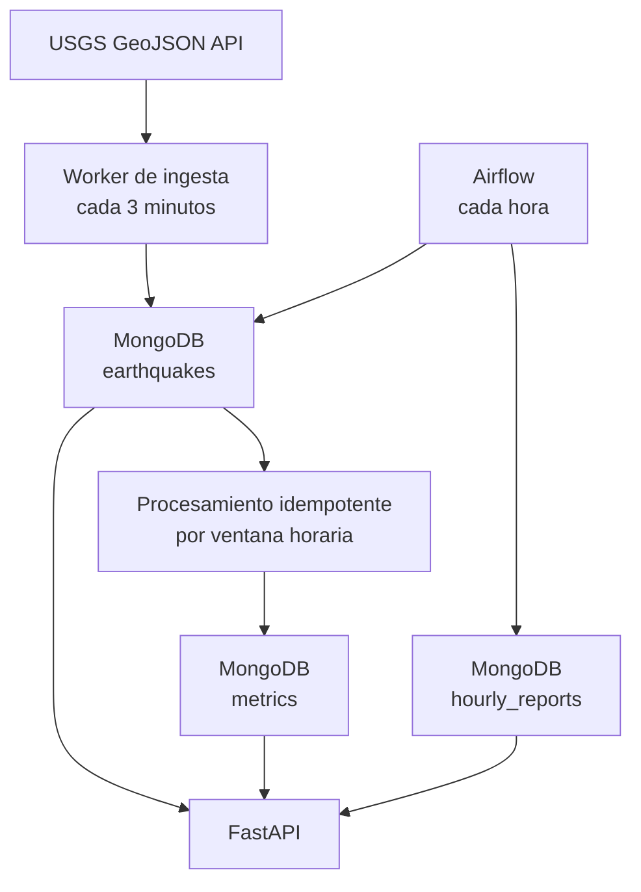

# Plataforma de eventos sísmicos USGS

Solución de la prueba técnica de procesamiento de eventos en near real-time con Python, FastAPI, MongoDB, Airflow y Docker Compose.

**Autor:** Javier Rodríguez Mosquera

El sistema consulta el feed público de USGS cada tres minutos, valida y normaliza cada evento, evita registros duplicados, actualiza métricas horarias inmediatamente y genera un reporte consolidado cada hora.

La solución incluye logs estructurados, validaciones con Pydantic, pruebas unitarias, colección Postman y un perfil opcional de observabilidad con Prometheus y Grafana.

## Inicio rápido

### Requisitos

* Docker Engine 24 o superior.
* Docker Compose v2.
* Python 3.11 o superior para generar el archivo de configuración y ejecutar las pruebas.

### 1. Crear el archivo de configuración

Desde la raíz del proyecto, ejecutar:

```bash
python scripts/generate_env.py
```

El script crea el archivo `.env` a partir de `.env.example` y genera contraseñas aleatorias para Airflow y Grafana.

Las credenciales generadas pueden consultarse abriendo el archivo `.env`.

### 2. Iniciar la plataforma

```bash
docker compose up --build
```

La primera consulta al servicio USGS ocurre al iniciar el worker. Las siguientes consultas se ejecutan según `INGESTION_INTERVAL_SECONDS`, cuyo valor predeterminado es 180 segundos.

### Configuración manual del entorno

Si no se desea utilizar el generador automático, el archivo puede crearse manualmente.

**Linux o macOS:**

```bash
cp .env.example .env
```

**Windows PowerShell:**

```powershell
Copy-Item .env.example .env
```

Después se deben reemplazar en `.env` los siguientes valores:

```env
AIRFLOW_PASSWORD=REPLACE_WITH_A_SECURE_PASSWORD
GRAFANA_PASSWORD=REPLACE_WITH_A_DIFFERENT_SECURE_PASSWORD
```

El archivo `.env` está incluido en `.gitignore` y no debe publicarse en el repositorio.

## Servicios disponibles

| Servicio | URL                        | Uso                                          |
| -------- | -------------------------- | -------------------------------------------- |
| FastAPI  | http://localhost:8000/docs | Documentación Swagger y consultas REST       |
| Airflow  | http://localhost:8080      | Administración del DAG de reportes horarios  |
| MongoDB  | `localhost:27017`          | Persistencia de eventos, métricas y reportes |

Las credenciales de Airflow están definidas en las variables `AIRFLOW_USERNAME` y `AIRFLOW_PASSWORD` del archivo `.env`.

## Observabilidad opcional

Para iniciar también Prometheus y Grafana:

```bash
docker compose --profile observability up --build
```

Servicios adicionales:

* Prometheus: http://localhost:9090
* Grafana: http://localhost:3000
* Métricas de FastAPI: http://localhost:8000/observability/metrics

Las credenciales de Grafana están definidas en las variables `GRAFANA_USERNAME` y `GRAFANA_PASSWORD` del archivo `.env`.

## Arquitectura



La ingesta y la API son procesos independientes. Ambos comparten contratos de dominio y repositorios, pero pueden escalarse y desplegarse por separado.

Airflow lee la capa operacional para crear reportes reproducibles e idempotentes. FastAPI consulta las colecciones de eventos, métricas y reportes sin acoplarse al proceso de ingesta.

## Flujo de procesamiento

1. El worker consulta el feed público de USGS cada tres minutos.
2. Cada elemento se transforma y valida mediante un modelo Pydantic.
3. El evento se almacena en MongoDB utilizando `event_id` como identificador único.
4. Los eventos duplicados son descartados mediante una operación atómica.
5. Se recalculan inmediatamente las métricas de la ventana horaria correspondiente.
6. Airflow genera y persiste un reporte consolidado cada hora.
7. FastAPI expone los eventos, métricas y reportes mediante endpoints REST.

## Endpoints

### `GET /earthquakes`

Consulta los eventos sísmicos almacenados.

```bash
curl "http://localhost:8000/earthquakes?page=1&page_size=10&min_magnitude=4&sort_by=magnitude&sort_order=desc"
```

Parámetros disponibles:

* `page`: número de página.
* `page_size`: cantidad de resultados por página.
* `min_magnitude`: magnitud mínima.
* `max_magnitude`: magnitud máxima.
* `start_time`: fecha inicial en formato ISO 8601.
* `end_time`: fecha final en formato ISO 8601.
* `location`: búsqueda parcial por ubicación.
* `sort_by`: `event_time` o `magnitude`.
* `sort_order`: `asc` o `desc`.

### `GET /metrics`

Consulta las métricas near real-time agrupadas por hora.

```bash
curl "http://localhost:8000/metrics?page=1&page_size=20"
```

### `GET /reports`

Consulta los reportes consolidados generados por Airflow.

```bash
curl "http://localhost:8000/reports?page=1&page_size=20"
```

### Endpoints de salud

```text
GET /health/live
GET /health/ready
```

Estos endpoints permiten verificar la disponibilidad de la API y la conexión con MongoDB.

## Decisiones de diseño

### Deduplicación

`earthquakes.event_id` tiene un índice único. La escritura utiliza `upsert` con `$setOnInsert`, por lo cual la verificación y la inserción se realizan de forma atómica.

Esto evita la condición de carrera que se produciría al consultar primero la existencia del evento y posteriormente intentar insertarlo.

### Procesamiento confiable

Cada evento nuevo se guarda inicialmente con:

```text
metrics_processed=false
```

Después de persistirlo, se recalculan las métricas de la ventana horaria a la que pertenece y el evento se marca como procesado.

Si ocurre una falla, la siguiente iteración identifica y recupera los eventos pendientes.

La métrica se recalcula a partir de los eventos almacenados y se sobrescribe mediante un `upsert`. Esta estrategia permite que los reintentos sean idempotentes y no incrementen incorrectamente los conteos.

Las ventanas horarias utilizan el intervalo:

```text
[window_start, window_end)
```

De esta forma, los eventos ubicados exactamente en el límite de una hora no se contabilizan dos veces.

### Rangos de magnitud

| Clave      | Rango                        |
| ---------- | ---------------------------- |
| `lt_2`     | Magnitud menor que 2         |
| `2_to_3_9` | Desde 2 y menor que 4        |
| `4_to_5_9` | Desde 4 y menor que 6        |
| `gte_6`    | Magnitud mayor o igual que 6 |

### Índices

| Colección        | Índice                                        | Objetivo                                  |
| ---------------- | --------------------------------------------- | ----------------------------------------- |
| `earthquakes`    | `event_id` único                              | Deduplicación atómica                     |
| `earthquakes`    | `event_time DESC, magnitude DESC`             | Filtros, ordenamiento y agregaciones      |
| `earthquakes`    | Parcial `metrics_processed=false, event_time` | Recuperación rápida de eventos pendientes |
| `metrics`        | `window_start` único                          | Un documento por ventana horaria          |
| `hourly_reports` | `report_date` único                           | Ejecución idempotente del DAG             |

### Manejo de errores

* Timeout y reintentos con backoff exponencial ante fallas de USGS.
* Validación de tipos, coordenadas, profundidad, magnitud y fecha con Pydantic.
* Descarte controlado de elementos inválidos sin detener el lote completo.
* Logs estructurados en JSON con contexto de ejecución y `event_id`.
* Health checks para los servicios.
* Reinicio automático de los contenedores.
* Pool reutilizable de conexiones con MongoDB.
* Recuperación de eventos pendientes de procesamiento.

## Airflow

El DAG `hourly_earthquake_report` se ejecuta con la expresión:

```text
@hourly
```

El proceso toma el intervalo de datos asignado por Airflow y persiste:

* Total de eventos.
* Magnitud promedio.
* Magnitud máxima.
* Tres ubicaciones con mayor número de eventos.
* Distribución por rangos de magnitud.

`report_date` tiene un índice único y la escritura utiliza un `upsert`. Por lo tanto, reejecutar una hora permite corregir o reconstruir el reporte sin generar duplicados.

Para una demostración inmediata, el DAG puede activarse manualmente desde Airflow después de que el worker haya almacenado eventos.

## Pruebas y calidad

### Crear el entorno virtual

```bash
python -m venv .venv
```

**Linux o macOS:**

```bash
source .venv/bin/activate
```

**Windows PowerShell:**

```powershell
.venv\Scripts\Activate.ps1
```

### Instalar las dependencias

```bash
pip install -r requirements-dev.txt
```

### Ejecutar las pruebas

```bash
pytest
```

### Ejecutar el análisis estático

```bash
ruff check .
```

### Validaciones del entorno Docker

```bash
docker compose config --quiet
docker compose ps
curl --fail http://localhost:8000/health/ready
```

## Colección Postman

La colección se encuentra en:

```text
postman/USGS Earthquake Platform.postman_collection.json
```

Para utilizarla:

1. Abrir Postman.
2. Seleccionar **Import**.
3. Seleccionar el archivo de la colección.
4. Confirmar que la variable `base_url` tenga el valor:

```text
http://localhost:8000
```

## Estructura del proyecto

```text
app/
  __init__.py
  config.py             Configuración mediante variables de entorno
  database.py           Conexión, health checks e índices de MongoDB
  ingestion_main.py     Proceso de ingesta desacoplado
  logging_config.py     Configuración de logs estructurados
  main.py               API FastAPI
  models.py             Contratos y validaciones Pydantic
  observability.py      Métricas para Prometheus
  repositories.py       Acceso a las colecciones de MongoDB
  services.py           Casos de uso de ingesta y procesamiento
  usgs_client.py        Cliente del servicio USGS

airflow/
  dags/
    hourly_earthquake_report.py

docs/
  advanced-analytics.md

monitoring/
  prometheus.yml
  grafana/
    dashboards/
    provisioning/

postman/
  USGS Earthquake Platform.postman_collection.json

scripts/
  generate_env.py

tests/
  test_models.py
  test_services.py
  test_usgs_client.py

.env.example
.gitignore
Dockerfile
Dockerfile.airflow
docker-compose.yml
requirements.txt
requirements-dev.txt
```

## Evolución hacia analítica avanzada

La propuesta de evolución se documenta en:

```text
docs/advanced-analytics.md
```

La arquitectura futura contempla:

* MongoDB como capa operacional.
* Change Streams o Kafka para integración orientada a eventos.
* Almacenamiento histórico en archivos Parquet.
* Separación entre las capas raw, curated y serving.
* Dashboards históricos y en tiempo real.
* Generación de datasets versionados para machine learning.
* MLflow para trazabilidad de experimentos y modelos.
* Estrategias de gobierno, calidad y linaje de datos.

## Alcance

Esta entrega prioriza un núcleo sencillo, modular y defendible.

La ejecución local utiliza un único worker de ingesta y Airflow en modo `standalone`, configuraciones adecuadas para la prueba técnica. Para un entorno productivo se recomienda utilizar un replica set de MongoDB, Airflow con PostgreSQL, workers separados, gestión centralizada de secretos, TLS, autenticación, autorización, CI/CD y alertas operativas.

