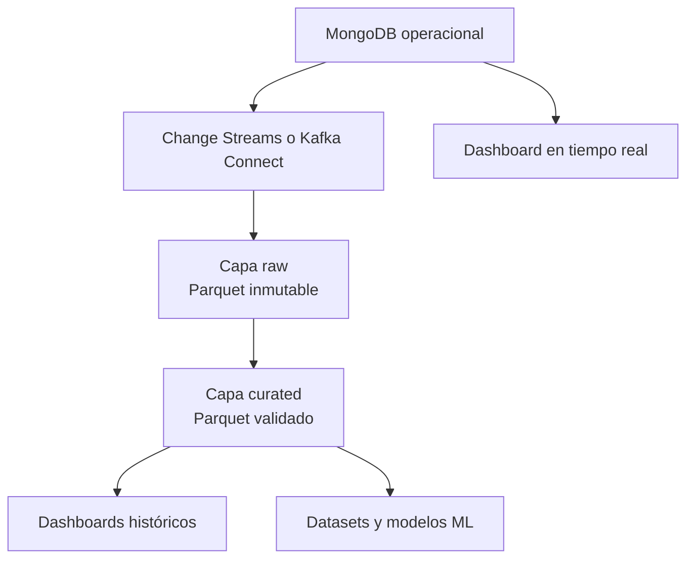

# Evolución hacia analítica avanzada y machine learning

## Objetivo

Separar la carga operacional de baja latencia de la conservación histórica y el procesamiento
analítico. MongoDB continúa atendiendo la API y las métricas recientes; el historial se conserva
como archivos Parquet particionados y optimizados para análisis masivo.



## Capas propuestas

| Capa | Tecnología posible | Contenido | Retención |
|---|---|---|---|
| Operacional | MongoDB replica set | Eventos recientes, métricas y reportes | 90 días en caliente |
| Raw | S3/MinIO + Parquet | Evento original, fecha de ingesta y versión de esquema | Indefinida e inmutable |
| Curated | Spark/Polars + Parquet | Datos limpios, enriquecidos y deduplicados | Indefinida |
| Serving | ClickHouse/DuckDB/Trino | Agregados para consultas históricas | Según demanda |
| ML | MLflow + feature tables | Variables, datasets versionados y experimentos | Según gobierno del modelo |

## Particionamiento Parquet

Ruta recomendada:

```text
earthquakes/year=2026/month=06/day=17/hour=10/part-*.parquet
```

Los archivos pequeños se compactan periódicamente hasta tamaños de 128-512 MB. El esquema
conserva `event_id` como clave de deduplicación y agrega `ingestion_time`, `source_version` y
campos de calidad. La capa curated aplica validaciones y permite evolución compatible del
esquema.

## Tiempo real

Para mayor escala, el worker publica cada evento validado en Kafka usando `event_id` como clave.
Consumidores independientes actualizan MongoDB, métricas y el almacenamiento raw. El patrón
Outbox o un conector CDC evita la escritura dual inconsistente. Un servicio WebSocket puede
transmitir los eventos recientes al dashboard sin acoplarlo al proceso de ingesta.

## Casos de machine learning

- Detección de eventos atípicos respecto al comportamiento histórico de una región.
- Clasificación de severidad combinando magnitud, profundidad y contexto geográfico.
- Pronóstico de carga del sistema y dimensionamiento de infraestructura; no se plantea predecir
  terremotos, afirmación científicamente injustificada con estos datos.
- Control de deriva de las variables y trazabilidad completa entre dataset, modelo y predicción.

## Gobierno y calidad

- Contratos de datos y validaciones automáticas al ingresar a cada capa.
- Catálogo con linaje desde USGS hasta dashboard o dataset.
- Cifrado, control de acceso por rol y secretos administrados fuera del código.
- Indicadores de completitud, puntualidad, validez y duplicidad.
- Política de backfill para reconstruir una partición sin modificar la capa raw.

